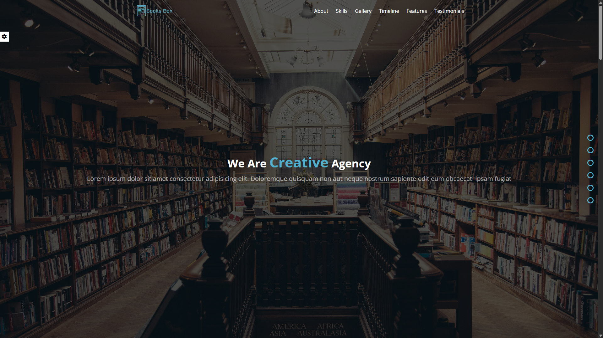
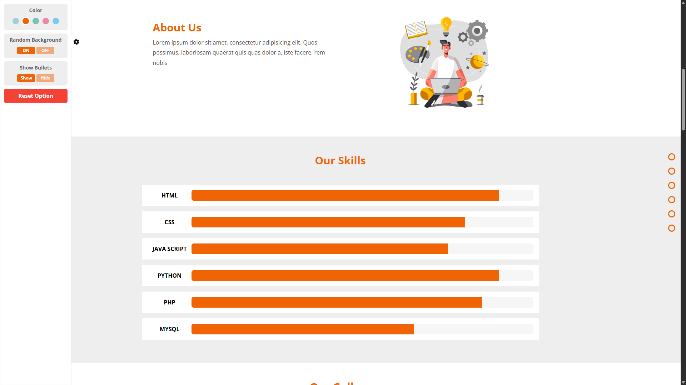
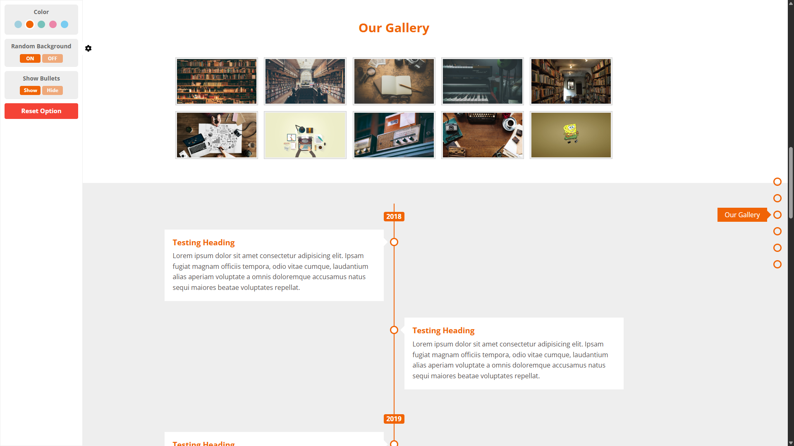
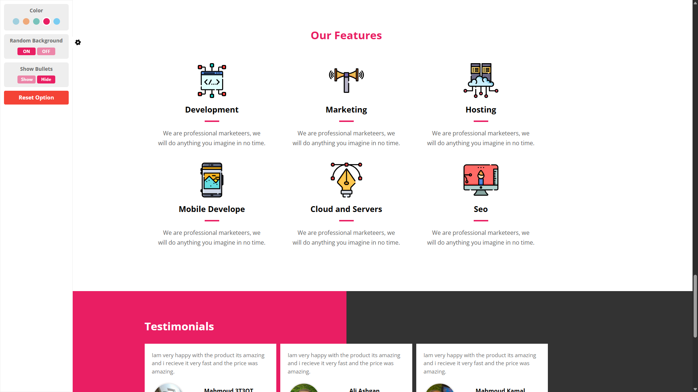
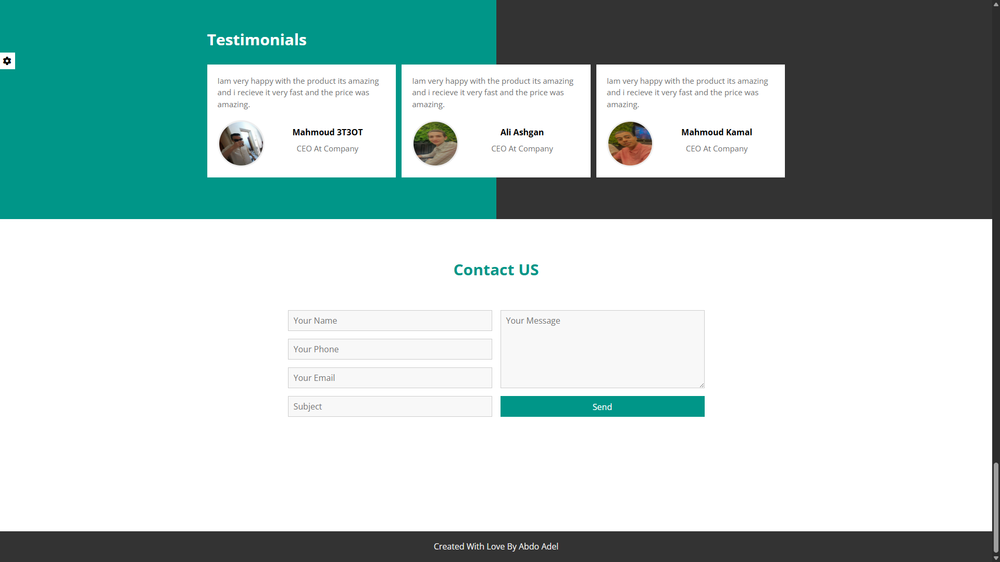

# 🎨 Special Design

A responsive and elegant landing page built using **HTML**, **CSS**, and **JavaScript**.  
This project showcases smooth animations, modern layout, and theme switching between light and dark modes.

---

## 🚀 Live Demo

🌐 [View Live](https://abd-el-rahman-adel-dev.github.io/special-design/)

---

## 📸 Screenshot

 <!-- أضف صورة من المشروع لو متوفرة -->
 <!-- أضف صورة من المشروع لو متوفرة -->
 <!-- أضف صورة من المشروع لو متوفرة -->
 <!-- أضف صورة من المشروع لو متوفرة -->
 <!-- أضف صورة من المشروع لو متوفرة -->

---

## ✨ Features

- 🌗 Toggle between **light** and **dark** themes using JavaScript  
- ⚙️ Smooth animations and transitions  
- 📱 Fully responsive design  
- 🎨 Modern and minimalistic layout  
- 🖱️ Hover effects and styled components

---

## 🛠 Tech Stack

- HTML5  
- CSS3 (Flexbox, Transitions, Gradients)  
- JavaScript (for theme toggle functionality)

---

## 📦 Getting Started

To run this project locally:

```bash
git clone https://github.com/abd-el-rahman-adel-dev/special-design.git
cd special-design
open index.html
```

Or just double-click `index.html` in your file manager.

---

## 📁 Project Structure

```
📦 special-design
┣ 📂 css
┃ ┗ 📜 style.css
┣ 📂 images
┣ 📜 index.html
┣ 📜 script.js

```

---

## 📄 License

This project is licensed under the [MIT License](./LICENSE).

---

## 🙋‍♂️ Author

- [Abd El-Rahman Adel](https://github.com/abd-el-rahman-adel-dev)
- [LinkedIn](https://www.linkedin.com/in/abdelrahman-adel-webdev)

---

> ⭐ If you like this landing page, consider starring the repo and reusing the template for your own projects.
